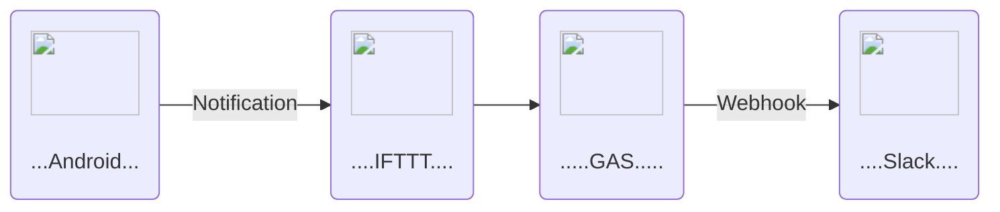

```mermaid
flowchart LR
   android("<img src='img/Android.png'; width='64'; height='64' /><br> ...Android...")
   ifttt("<img src='img/ifttt.png'; width='64'; height='64' /><br>....IFTTT....")
   gas("<img src='img/gas.png'; width='64'; height='64' /><br>.....GAS.....")
   slack("<img src='img/slack.png'; width='64'; height='64' /><br>....Slack....")

   android -- Notification --> ifttt
   ifttt --> gas
   gas -- Webhook --> slack
```
